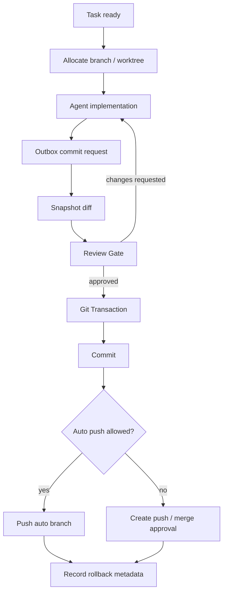

# Kairon Git Workspace v0

## 目的

Git Workspace Manager は、Kairon が code-producing job を安全に扱うための Git 境界である。
Agent は実装や調査を行うが、branch / worktree / commit / push / rollback metadata の最終操作は Git Workspace Manager が policy に基づいて実行する。

この仕様は次を固定する。

- 1 つの実装 task に専用 branch / worktree を割り当てる。
- code-producing job は review gate 通過前に commit / push しない。
- commit / push は Git transaction として記録し、commit ID と rollback path を残す。
- Merge / Deploy は Git Workspace Manager の自動実行対象にしない。
- 競合は path lock、branch lock、base branch との差分確認で早期検出する。

## 基本方針

- Kairon は protected branch に直接 write しない。
- Agent は Git commit / push を直接実行しない。
- Agent が行う Git 操作は `status`、`diff`、`log`、`show` などの read-only に限定する。
- 実装 Agent は割り当てられた worktree のみを write する。
- reviewer / qa は実装 worktree、固定 diff、run artifact を read-only で確認する。
- Review Gate を通過した diff だけが commit 対象になる。
- Push は policy で許可された場合だけ実行する。MVP では `allow_auto_push=false` を既定にする。
- すべての Git 操作は event log と transaction file に記録する。

## 責務境界

| Component | やること | やらないこと |
| --- | --- | --- |
| Agent Dispatcher | job に必要な git capability を要求する | branch を作らない |
| Agent Runner | Agent session に worktree path を渡す | commit / push しない |
| Git Workspace Manager | worktree、branch、lock、diff、commit、push、rollback metadata を扱う | review 判定、merge、deploy |
| Review Loop Manager | diff review と quality gate を判定する | commit / push しない |
| State Applier | git event を canonical state へ反映する | git command を実行しない |

## Directory Layout

MVP では `.kairon/worktrees/` を既定の worktree root とする。
`.kairon/` は対象 project の `.gitignore` に含める。

```text
.kairon/
  git/
    branches/
      TASK-0001.json
    transactions/
      GTX-0001.json
    locks/
      branch-auto-TASK-0001-codex.json
      path-src-approval.json
  worktrees/
    TASK-0001-codex/
  runs/
    RUN-0001/
      diff.patch
      changed-files.json
```

将来的に repository 内の nested worktree が tooling と衝突する場合は、`worktree_root` を project 外の local cache に変更できるようにする。

## Config

`policies.json` の Git section は次を持つ。

```json
{
  "git": {
    "default_base_branch": "main",
    "remote": "origin",
    "worktree_root": ".kairon/worktrees",
    "allow_auto_commit": true,
    "allow_auto_push": false,
    "require_review_before_commit": true,
    "auto_branch_prefixes": ["auto/", "codex/", "claude/", "gemini/"],
    "branch_template": "auto/{task_id}/{agent}",
    "require_approval_for": ["merge", "deploy", "protected_branch_push", "force_push", "branch_delete"],
    "protected_branches": ["main", "master", "develop", "release/*"],
    "require_clean_base_worktree": true,
    "max_parallel_writers_per_path": 1,
    "conflict_strategy": {
      "path_overlap": "block",
      "base_branch_moved": "recheck_before_push",
      "merge_conflict": "escalate"
    },
    "rollback_strategy": {
      "pre_commit": "discard_worktree_with_artifact",
      "committed_unpushed": "reset_branch_to_parent",
      "pushed_unmerged": "revert_commit",
      "merged": "revert_commit"
    }
  }
}
```

MVP の default は安全側に寄せる。

- `allow_auto_commit=true`
- `allow_auto_push=false`
- `require_review_before_commit=true`
- `protected_branch_push` は approval 必須
- `force_push` と `branch_delete` は approval 必須

## Branch Naming

既定 branch 名は次の形式にする。

```text
auto/{task_id}/{agent}
```

例:

```text
auto/TASK-0001/codex
auto/TASK-0002/claude
auto/TASK-0003/gemini
```

同じ task で複数 candidate branch が必要な場合だけ suffix を付ける。

```text
auto/TASK-0001/codex-2
```

Branch 作成時の制約。

- prefix が `auto_branch_prefixes` に含まれる。
- `protected_branches` に一致しない。
- 同じ branch を複数 writer が保持しない。
- branch metadata が `.kairon/git/branches/{task_id}.json` に存在する。

## Worktree Allocation

実装 job の開始前に Git Workspace Manager が worktree を準備する。

```text
task accepted
  -> resolve base branch
  -> acquire task lock
  -> acquire branch lock
  -> acquire path write locks
  -> create or resume branch
  -> create or resume worktree
  -> write branch metadata
  -> pass worktree path to Agent Runner
```

Worktree metadata。

```json
{
  "schema_version": "0.1",
  "task_id": "TASK-0001",
  "branch": "auto/TASK-0001/codex",
  "agent": "codex",
  "base_branch": "main",
  "base_sha": "1111111",
  "worktree_path": ".kairon/worktrees/TASK-0001-codex",
  "status": "active",
  "writer_lock": ".kairon/git/locks/branch-auto-TASK-0001-codex.json",
  "created_at": "2026-05-24T10:00:00+09:00"
}
```

## Agent Contract

Agent に渡す context には必ず Git boundary を含める。

```json
{
  "git_workspace": {
    "task_id": "TASK-0001",
    "worktree_path": ".kairon/worktrees/TASK-0001-codex",
    "branch": "auto/TASK-0001/codex",
    "allowed_git_commands": ["status", "diff", "log", "show"],
    "disallowed_git_commands": ["commit", "push", "merge", "rebase", "reset --hard", "checkout"],
    "write_paths": ["src/**", "tests/**"],
    "protected_paths": [".env*", ".github/workflows/**", "infra/**"]
  }
}
```

Agent の outbox は commit を直接作った結果ではなく、commit request を出す。

```json
{
  "git": {
    "branch": "auto/TASK-0001/codex",
    "commit_requested": true,
    "push_requested": false,
    "changed_files_path": ".kairon/runs/RUN-0001/changed-files.json",
    "diff_path": ".kairon/runs/RUN-0001/diff.patch"
  }
}
```

## Diff Snapshot

Review 前に Git Workspace Manager は diff を固定する。

```text
implementation.completed
  -> collect changed files
  -> verify allowed paths
  -> generate diff.patch
  -> generate changed-files.json
  -> record diff snapshot hash
  -> review.requested
```

Diff snapshot schema。

```json
{
  "schema_version": "0.1",
  "task_id": "TASK-0001",
  "run_id": "RUN-0001",
  "branch": "auto/TASK-0001/codex",
  "base_sha": "1111111",
  "diff_path": ".kairon/runs/RUN-0001/diff.patch",
  "diff_sha256": "abc...",
  "changed_files": [
    {
      "path": "src/approval.ts",
      "status": "modified",
      "additions": 24,
      "deletions": 2
    }
  ],
  "created_at": "2026-05-24T10:20:00+09:00"
}
```

Review は `diff_sha256` を対象として実施する。
Review 後に diff が変わった場合は review result を無効化し、再 review に戻す。

## Review Before Commit

code-producing job の commit 条件。

```text
commit_requested
  -> diff snapshot exists
  -> diff hash unchanged
  -> review gate passed
  -> required checks passed
  -> secret scan passed
  -> git transaction starts
  -> commit
```

Review Gate の入力は commit SHA ではなく diff snapshot でよい。
commit SHA は Review Gate 通過後に確定する。

## Git Transaction

Git 操作は transaction として扱う。

```text
planned
  -> prepared
  -> checked
  -> reviewed
  -> committing
  -> committed
  -> pushing
  -> pushed
```

失敗時は `failed` または `aborted` にする。

Transaction schema。

```json
{
  "schema_version": "0.1",
  "transaction_id": "GTX-0001",
  "task_id": "TASK-0001",
  "run_id": "RUN-0001",
  "branch": "auto/TASK-0001/codex",
  "worktree_path": ".kairon/worktrees/TASK-0001-codex",
  "status": "committed",
  "base_sha": "1111111",
  "parent_sha": "1111111",
  "commit_sha": "2222222",
  "diff_sha256": "abc...",
  "checks": [
    { "name": "test", "status": "passed" },
    { "name": "secret_scan", "status": "passed" },
    { "name": "review", "status": "passed" }
  ],
  "push": {
    "requested": false,
    "allowed": false,
    "remote": "origin",
    "remote_ref": null,
    "pushed": false
  },
  "rollback": {
    "strategy": "reset_branch_to_parent",
    "parent_sha": "1111111",
    "command_hint": "git reset --hard 1111111"
  },
  "created_at": "2026-05-24T10:30:00+09:00",
  "updated_at": "2026-05-24T10:31:00+09:00"
}
```

`command_hint` は人間と Agent の判断材料であり、自動実行する rollback command ではない。
rollback 自動実行は別 policy で許可された場合だけ行う。

## Implementation Status

T13-02 では次の最小実行境界を実装済み。

- `GitWorkspaceManager.allocate` に path write lock を追加。
- `GitTransactionExecutor.executeCommit` で review 済み diff だけを commit 対象にする。
- `git worktree add -B`、`git add --all`、`git commit`、`git rev-parse` を injectable command runner 経由で実行する。
- transaction artifact を `.kairon/git/transactions/GTX-xxxx.json` に保存する。
- `commit_sha`、`parent_sha`、rollback metadata を transaction に記録する。
- `allow_auto_push=false` または protected branch push は approval queue へ止める。

未接続の範囲。

- `task run` から自動で Git transaction を開始する runtime wiring。
- 実 worktree での end-to-end smoke。
- push 承認後の実 push resume。
- rollback command の自動実行。

## Commit Policy

Commit を許可する条件。

- `policies.git.allow_auto_commit=true`
- branch が許可 prefix を持つ。
- branch が protected branch ではない。
- branch lock を保持している。
- path lock を保持している。
- diff snapshot が review 済み hash と一致する。
- Review Gate が `approved`。
- required checks が passed。
- secret scan が passed。
- protected path が変更されていない。変更されている場合は approval 必須。

Commit message は Kairon が生成し、task / run / review を参照する。

```text
TASK-0001 Add Discord approval request event

Kairon-Task: TASK-0001
Kairon-Run: RUN-0001
Kairon-Review: REV-0001
Kairon-Diff-SHA256: abc...
```

## Push Policy

Push を許可する条件。

- `policies.git.allow_auto_push=true`
- Commit Policy を満たしている。
- push 先 branch が protected branch ではない。
- remote が `policies.git.remote` と一致する。
- base branch との差分検査が完了している。
- force push ではない。

MVP では `allow_auto_push=false` を既定にするため、commit 後に push approval request を作るだけでよい。
ユーザーが auto push を許可した project だけ push まで自動実行する。

## Conflict Detection

Kairon は 3 種類の競合を扱う。

| 種類 | 検出タイミング | MVP 対応 |
| --- | --- | --- |
| Path conflict | job allocation / commit 前 | 同じ path に writer がいる場合は block |
| Branch conflict | branch allocation / transaction 前 | 同じ branch writer がいる場合は block |
| Base conflict | commit 後 push 前 / maintenance | base branch との差分を確認し conflict なら escalate |

Path lock は file glob 単位で持つ。

```json
{
  "schema_version": "0.1",
  "lock_id": "LOCK-path-src-approval",
  "type": "path_write",
  "task_id": "TASK-0001",
  "run_id": "RUN-0001",
  "paths": ["src/approval/**", "tests/approval/**"],
  "owner": "git-workspace-manager",
  "expires_at": "2026-05-24T18:00:00+09:00"
}
```

Conflict 判定の結果は task に戻す。

```json
{
  "type": "git.conflict.detected",
  "payload": {
    "task_id": "TASK-0002",
    "conflict_type": "path_overlap",
    "paths": ["src/approval.ts"],
    "blocked_by": ["TASK-0001"],
    "action": "queued"
  }
}
```

## Rollback Metadata

Kairon は rollback 可能性を commit / push 結果に必ず記録する。

| 状態 | 推奨 rollback path | 自動実行 |
| --- | --- | --- |
| pre_commit | worktree 破棄または再生成 | 条件付き |
| committed_unpushed | branch を parent に戻す、または branch を作り直す | approval 推奨 |
| pushed_unmerged | revert commit を作る | approval 必須 |
| merged | revert PR / revert commit | approval 必須 |
| deployed | deploy rollback plan | approval 必須 |

Kairon は destructive rollback を既定で自動実行しない。
rollback は command hint、対象 commit、影響範囲、approval requirement を提示する。

## Cleanup

Worktree cleanup は日次メンテで提案する。

自動削除してよいもの。

- failed run の空 worktree
- commit 前で diff artifact が保存済みの abandoned worktree
- user が cleanup approval した worktree

自動削除しないもの。

- approval 待ち branch の worktree
- push 済み branch の worktree
- merge / rollback 判断待ちの worktree

Cleanup proposal は `.kairon/cleanup/` に保存し、MorningReview の最初の task として扱う。

## Events

Git Workspace Manager は次の event を出す。

- `git.worktree.created`
- `git.worktree.resumed`
- `git.branch.created`
- `git.diff.snapshotted`
- `git.transaction.started`
- `git.transaction.checked`
- `git.committed`
- `git.pushed`
- `git.conflict.detected`
- `git.rollback.proposed`
- `git.transaction.failed`

## End-to-End Flow

```text
task ready
  -> Git Workspace Manager allocates branch / worktree
  -> Agent Runner sends job to CLI Agent
  -> Agent edits files in assigned worktree
  -> Agent writes outbox with commit request
  -> Git Workspace Manager snapshots diff
  -> Review Loop Manager reviews diff
  -> quality gate passes
  -> Git Workspace Manager starts transaction
  -> checks / secret scan
  -> commit
  -> optional push if policy allows
  -> State Applier records commit_sha / parent_sha / rollback metadata
  -> approval request for merge / deploy
```

## Mermaid Overview



## MVP Done Criteria

- `kairon task run` が task 専用 worktree / branch を作る。
- Agent context に worktree path と Git command boundary が入る。
- Agent は outbox で commit request を出す。
- Review 前に `diff.patch` と `changed-files.json` が保存される。
- Review Gate 通過前は commit されない。
- Review Gate 通過後、policy が許す場合だけ commit される。
- Commit 後に `commit_sha`、`parent_sha`、`rollback` が task state に入る。
- `allow_auto_push=false` の場合は push せず approval queue に積む。
- protected branch / protected path / force push は approval に止まる。
- path overlap がある並列 task は競合として block または queue される。
